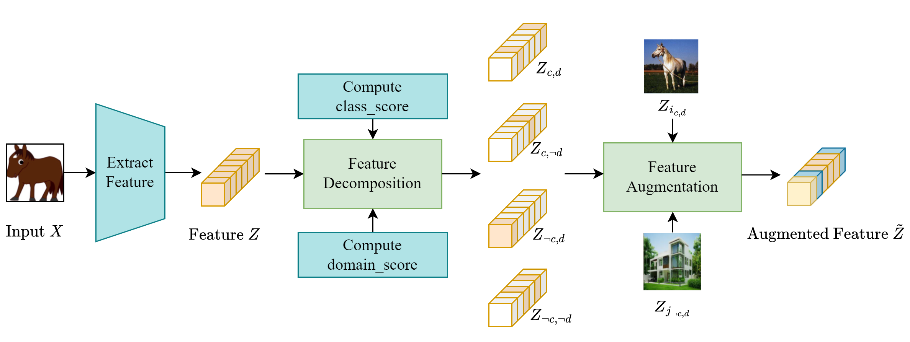

# Cross-Domain Feature Augmentation for Domain Generalization

This repository contains the implementation of the XDomainMix algorithm and empirical studies in Cross-Domain Feature Augmentation for Domain Generalization in IJCAI 2024. The arXiv version of the paper and the supplementary materials can be found at https://arxiv.org/abs/2405.08586.

## Overview 

XDomainMix performs feature augmentation to increase sample diversity while emphasizing the learning of invariant representations to achieve domain generalization. 
We decompose features into class-generic, class-specific, domain-generic, and domain-specific components, based on feature semantics' correlation with class and domain.
Feature augmentation is performed by changing domain-specific components of a feature while preserving class-specific components.

<p align="center">
       
</p>

On benchmark datasets, we achieve the following results:

| Method        | Camelyon17   | FMoW         | PACS         | TerraIncognita   | DomainNet    |
|---------------|--------------|--------------|--------------|------------------|--------------|
| ERM           | 70.3±6.4     | 32.3±1.3     | 85.5±0.2     | 46.1±1.8         | 43.8±0.1     |
| GroupDRO      | 68.4±7.3     | 30.8±0.8     | 84.4±0.8     | 43.2±1.1         | 33.3±0.2     |
| RSC           | 77.0±4.9     | 32.6±0.5     | 85.2±0.9     | 46.6±1.0         | 38.9±0.5     |
| MixStyle      | 62.6±6.3     | 32.9±0.5     | 85.2±0.3     | 44.0±0.7         | 34.0±0.1     |
| DSU           | 69.6±6.3     | 32.5±0.6     | 85.5±0.6     | 41.5±0.9         | 42.6±0.2     |
| LISA          | 77.1±6.5     | 35.5±0.7     | 83.1±0.2     | 47.2±1.1         | 42.3±0.3     |
| Fish          | 74.7±7.1     | 34.6±0.2     | 85.5±0.3     | 45.1±1.3        | 42.7±0.2     |
| XDomainMix    | **80.9±3.2** | **35.9±0.8** | **86.4±0.4** | **48.2±1.3**     | **44.0±0.2**|


## Implementation

The code is based on [DomainBed](https://github.com/facebookresearch/DomainBed) by [Gulrajani and Lopez-Paz, 2020](https://arxiv.org/abs/2007.01434), and [LISA](https://github.com/huaxiuyao/LISA) by [Yao et al., 2022](https://arxiv.org/abs/2201.00299).

The dependencies in `requirments.txt` should be installed to run the experiments.


### Training to get domain generalization performance 

**Camelyon and FMoW dataset**
- under `wilds/` directory, run 
```
python main.py --dataset {dataset_name} --algorithm xdomain_mix --data-dir '/my/datasets/path'
``` 

**PACS, TerraIncognita and DomainNet dataset** (based on the README of DomainBed)
- download data by running 
```
python -m domainbed.scripts.download --data_dir=/my/datasets/path
```
- train a model 
```
python -m domainbed.scripts.train --algorithm xdomain_mix --data_dir /my/datasets/path --dataset {dataset_name} --test_envs 0 
```
- alternatively, launch a sweep that trains multiple models
```
python -m domainbed.scripts.sweep launch\
       --data_dir=/my/datasets/path\
       --output_dir=/my/sweep/output/path\
       --command_launcher multi_gpu\
       --algorithms xdomain_mix\
       --datasets PACS TerraIncognita DomainNet\
       --n_hparams 1\
       --n_trials 3\
       --single_test_envs
```

- collect result from a sweep
```
python -m domainbed.scripts.collect_results --input_dir=/my/sweep/output/path
```


### Model invariance 

Representation invariance
```
python -m feature_invariance.invariance_feature \
       --dataset {dataset_name} \
       --input_dir /my/sweep/path \
       --result_file /path/to/store/result/file
```

Predictor invariance
```
python -m feature_invariance.invariance_predictor \
       --dataset {dataset_name} \
       --input_dir /my/sweep/path \
       --result_file /path/to/store/result/file 
```

### Feature divergence
```
python -m feature_divergence.augmentation_divergence \
       --dataset {dataset_name} \
       --data_dir /my/dataset/path \
       --output_dir /path/to/store/result/file \
       --algorithm xdomain_mix
```

### Feature importance 

```
python -m feature_importance.eval_feature_importance \
       --dataset {dataset_name} \
       --data_dir /my/dataset/path  \
       --output_dir /saved/model/path
```

### Feature visualization
Specify data dir (path to dataset) and model dir (path to saved model) in the notebooks 

## Citation
 If you find our paper useful, you are welcome to cite it as 

 ```
 @inproceedings{liu2024cross,
  title     = {Cross-Domain Feature Augmentation for Domain Generalization},
  author    = {Liu, Yingnan and Zou, Yingtian and Qiao, Rui and Liu, Fusheng and Lee, Mong Li and Hsu, Wynne},
  booktitle = {Proceedings of the Thirty-Third International Joint Conference on
               Artificial Intelligence, {IJCAI-24}},
  publisher = {International Joint Conferences on Artificial Intelligence Organization},
  editor    = {Kate Larson},
  pages     = {1146--1154},
  year      = {2024},
  month     = {8},
  note      = {Main Track},
  doi       = {10.24963/ijcai.2024/127},
  url       = {https://doi.org/10.24963/ijcai.2024/127},
}

 ```
